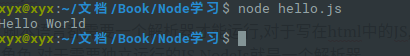
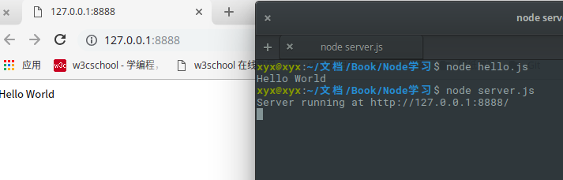

## 什么是NodeJs

JS是脚本语言,脚本语言都需要一个解析器才能运行,对于写在html中的JS,浏览器充当了解析器的角色,对于需要独立运行的JS,NodeJs就是一个解析器.

每一种解析器都是一个运行环境,不但允许JS定义各种数据结构,进行各种计算,还允许JS使用环境中提供的内置对象和方法做一些事情.

例如运行在浏览器中的JS用途是操作DOM,浏览器提供了`document`的内置对象.

运行在NodeJs中的JS用途时操作磁盘文件或搭建HTTP服务器,NodeJs提供了相应的`fs`,`http`等内置对象.

## 第一个Nodejs程序

新建一个hello.js文件,其中输入:

```javascript
console.log("Hello World");
```

在终端中进入目录,并输入命令:`node hello.js`,就可以看到:



或者直接进入终端:

```
$ node
> console.log('hello world!');
hello world!
```

## 第一个应用

1. 引入`require`模块
2. 创建服务器
3. 接受与响应请求

### 引入`require`模块

```javascript
var http=require("http");
```

### 创建服务器

创建一个server.js保存:

```javascript
var http=require("http");

http.createServer(function(request,response){
    response.writeHead(200,{'Content-Type':'text/plain'});
    response.end('Hello World\n');
}).listen(8888);

console.log("Server running at http://127.0.0.1:8888/")
```

### 接受与响应请求

接下来我们开启这个服务器:

```
node server.js
Server running at http://127.0.0.1:8888
```

结果如下:



