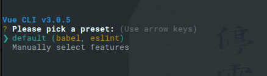
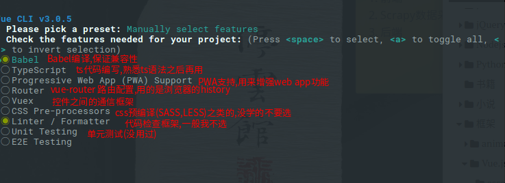
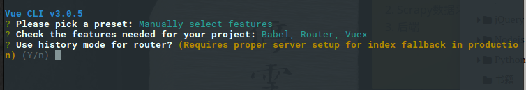
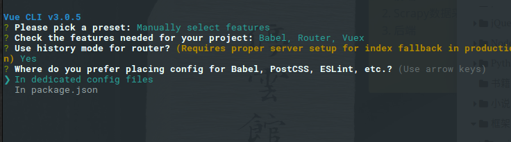
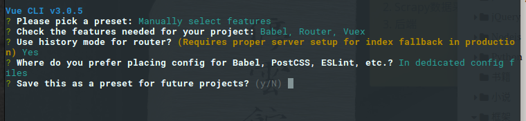
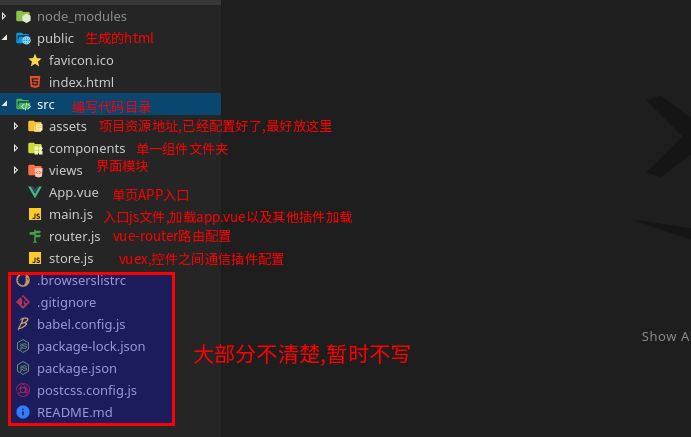

## 安装vue-cli 3.0

```
npm i @vue/cli -g
```

## 新建一个项目

```
vue create vue-test
```

### 选择环境



1. 表示默认配置(babel编译,eslint代码检查)
2. 自定义特性



一般选中自己需要的就行了,我的是:

```
Babel,Router,Vuex
```



是否使用history模式路由?(yes)



你更喜欢在哪里配置你的babel,postcssm,eslint?

额,选第一个好了.



no(就是不用此配置为预设配置)

接下来等待安装成功就行了

## 安装成功

