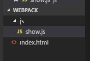
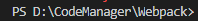
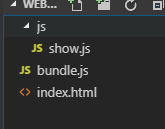
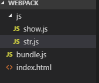
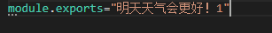
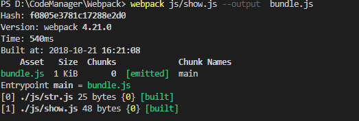

# 命令行打包

## 创建一个文件夹



文件夹为如上结构

## index.html中输入内容：

```
<!DOCTYPE html>
<html lang="en">
<head>
    <meta charset="UTF-8">
    <meta name="viewport" content="width=device-width, initial-scale=1.0">
    <meta http-equiv="X-UA-Compatible" content="ie=edge">
    <title>Document</title>
</head>
<body>
    
</body>
<script type="text/javascript" src="bundle.js"></script>
</html>
```

bundle.js还未生成

## show.js内容输入：

```
document.write("今天天气非常好！");
```

## 打开终端，进入工作目录：



输入如下命令进行单文件打包：

由于我的版本是`4.21.0`,命令是：

`webpack js/show.js --output  bundle.js`

## 可以看到这样的目录：



这样打包就好了

# 第二部

## 接着我们创建一个str.js



内容如下：



## 修改show.js

我们导入str.js的内容：

```
import str from './str.js'
document.write(str);
```

## 命令行打包：



可以看到我们对一个show.js打包后，str.js也被打包进去了；


# 总结

打包一个文件的时候，会检测这个是否有依赖关系，如果有，那么就会来连同依赖的文件一起打包。