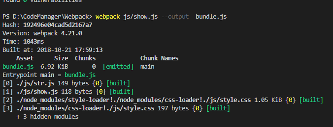

通过安装loader加载器，可以将静态的样式文件一同打包到bundle.js中

```
npm install css-loader style-loader
```

css-loader遍历一下样式代码

style-loader将样式直接插入文档之中

```
require("!style-loader!css-loader!./style.css");//注意顺序一定是这样的
document.write("<h1>dsadsad</h1>")
```

可以看到，打包的时候一起打包了

