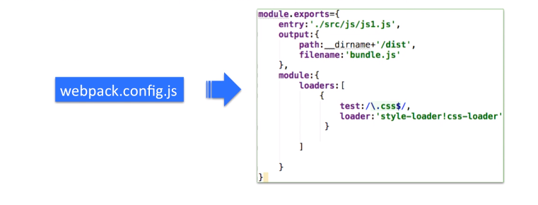
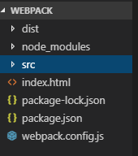
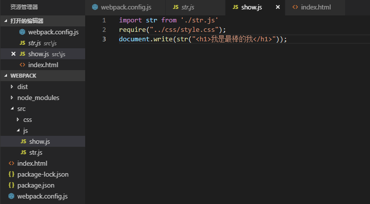

# webpack.config.js



简单配置代码：

```
module.exports={
    entry:'./src/js/show.js',//入口文件
    output:{
        path:__dirname + "/dist",//输出路径
        filename:'bundle.js',//输出文件名称
    },
    module:{
        loaders:[
            {
                // 凡是css文件，都会使用这两种加载器加载
                test:/\.css$/,
                loader:'style-loader!css-loader'
            }
        ]
    }
}
```

版本不同，代码不同，我的现在是：

```
module.exports={
    entry:'./src/js/show.js',//入口文件
    output:{
        path:__dirname + "/dist",//输出路径
        filename:'bundle.js',//输出文件名称
    },
    module:{
        rules:[
            {
                // 凡是css文件，都会使用这两种加载器加载
                test:/\.css$/,
                loader:'style-loader!css-loader'
            }
        ]
    }
}
```

测试代码结构：



入口文件代码改变了：

